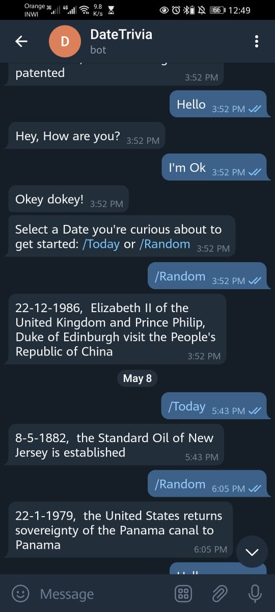

# telegram_bot

A telegram bot that you can use to get trivial information about  dates. 

to try it launch the Telegram app and search for @DateTrivia

The bot uses numbers api from [rapidapi](https://rapidapi.com/divad12/api/numbers-1)

## Built With

- Ruby  

## Getting Started

To get a local copy up and running follow these simple example steps.

Go to https://github.com/safafa/telegram_bot

1. Install ruby on your local machine
2. Click on the code and copy the code.
3. Use a terminal to clone this repository on your local machine.
4. Browse to the repository folder on your local machine and run <code> bundle install </code> to install all the gems needed for this code to work.
5. Create a bot using the Botfather in the telegram app.
6. Copy the token and place it in datebot.rb and bot_spec.rb instead of <code>BOTKEY = ""</code> do <code> BOTKEY = "token"</code>.
9. To make your contributions. Run <code>git checkout -b your-branch-name</code>.
10. Push your branch up to your forked repository.

## Running tests

To run the tests locally :

- Run each file in the spec folder individually.

   eg : `rspec ./spec/bot_spec.rb`  `rspec ./spec/dateapi_spec.rb`

## Instructions

1) Open your terminal:
    - On Windows => <code>Win + R</code>
    - On Linux => <code>ctrl + alt + T</code>
    - On Mac => <code>Control + Option + Shift + T</code>

2) Go to the directory where the bot is located, it will be the one where you cloned the repository. After you follow the steps in getting started, execute the datebot.rb by typing:
    - <code>ruby bin/datebot.rb</code>

3) Alright! Your bot is up and running.

Have fun!

## Author

👤 **Safa Aballagh**

- GitHub: [@Safafa](https://github.com/safafa)
- Twitter: [@safa aballagh](https://twitter.com/Aballagh_S)
- LinkedIn: [Aballagh Safa](https://www.linkedin.com/in/aballaghsafa/)

## Contributing

Contributions, issues, and feature requests are welcome!

Feel free to check the [issues page](https://github.com/safafa/telegram_bot/issues).

## Show your support

Give a ⭐️ if you like this project!

## Acknowledgments

- To [Zeenat Lawal](https://github.com/ZeenatLawal) and [Sebastián Rizzuto](https://github.com/srizzuto)
- To my Stand Up Team who kept my morale up!
